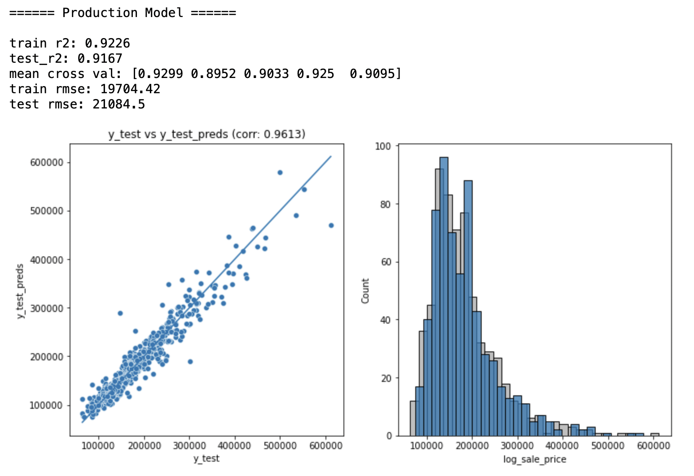

# DSI - Project 2 : Linear Regression Model on Ames Housing Dataset to Predict Sale Prices

### Contents:
- [Problem Statement](#Problem-Statement)
- [Repository Structure](#Repository-Structure)
- [Scenario Analysis](#Scenario-Analysis)
- [Conclusions and Recommendations](#Conclusions-and-Recommendations)


### Problem Statement 

Regardless of whether one chooses to buy or sell a home, knowing how much that home is worth is essential before making such a significant financial choice. That is the concern of homebuyers and sellers have in Ames, Iowa . If we have familiar with the features of a home in Ames, how can we estimate its price?

To answer that question, the price of a house at the sale will be predicted using a linear regression model built using the Ames Housing Dataset.

<br>

### Repository Structure 
```
dsi_project_ames
|
|__ code
|   |__ 01_data_cleaning.ipynb
|   |     - EDA to understand the dataset
|   |     - Cleaning of missing values using different  
|   |       methods
|   |__ 02_data_preprocessing.ipynb 
|   |     - Grouping of columns
|   |     - Removing redundant columns
|   |     - Cleaning up categorical values  
|   |__ 02_data_preprocessing_discrete_to_category.ipynb
|   |     - Converting discrete columns to categorical      
|   |       instead of numerical
|   |     - Everything else is the same as above
|   |__ 03_model_benchmarking.ipynb 
|   |     - Creating a benchmarking model 
|   |__ 04_model_comparison.ipynb
|   |     - Iterating over many combinations of models   
|   |       to find the optimal model
|   |__ 05_kaggle_competition.ipynb
|   |     - File to generate kaggle competition format   
|   |       of prediction csv to submit on kaggle
|   |__ 06_production_model_evaluation.ipynb
|           - This display performance of selection model   
|           for production as well as gives an         
|           overview of why this model was selected.        
|                         
|__ datasets
|   |__ train.csv
|   |__ test.csv
|   |__ train_fill.csv
|   |__ test_fill.csv
|   |__ train_cleaned.csv
|   |__ test_cleaned.csv
|   |__ test_cleaned_discrete.csv
|   |__ submission.csv
|
|__ figure
|   |__ 2nd_floor.png
|   |__ basement_sf.png
|   |__ bath.png
|   |__ ...
|
|__ model
|   |__ all_num_6_quality_cat.sav
|   |__ all_num_6qual_neighbour.sav
|   |__ all_num_10_cat.sav
|   |__ all_num_many_cat.sav
|
|__ README.md
|
|__ data_dictionary.md
```

### Scenario Analysis

The first `01_data_cleaning.ipynb` notebook begins by importing and cleaning a training data set 2197 homes with 82 different features. Once cleaned, we examine columns that have high missing values which need to be explored in the datasets. All details about different features can be found in `data_dictionary.md`. To impute missing values, they can be categorized into 3 types such as columns with over 80% missing values, columns that missing values defined as None, 0 or No from data dictionary and statistics imputed missing values. 
<br>

After that `02_data_preprocessing.ipynb`
notebook is used for preprocessing, feature engineering, and outlier cleaning. The related columns are grouped together, then features that have the highest correlation with sale price are selected both numerical and categorical columns. For feature engineering, the correlation of features with sale price and log sale price are compared. The result shows that log sale price is more related to those features. In order to maximize the efficiency of linear regression, we need to manage outliers by selecting the unreasonable data comparing to sale price. For the columns with categorical data are converted into binary values which allows linear regression to work.
<br>

Next step is to create benchmarking model by selecting the features that have high correlation with sale price using `03_model_benchmarking.ipynb`. The obtained benchmarking model is used as an initiative data for improving further model. The model `04_model_comparison.ipynb` is continuously adjusted until it becomes overfit regarding the result in `05_kaggle_competition.ipynb`. The most suitable model `06_production_model_evaluation.ipynb` is selected and used to predict sale price of house in Ames, Iowa.

 <br>

### Conclusions and Recommendations
The model selected for production consists of:

```
# Numerical Columns 25

num_cols = ['overall_quality', 'total_sf','garage_cars','total_bath','year_built', 'has_fireplace', 'total_rooms_above_ground','has_open_porch', 'masonry_area', 'log_lot_area', 'lot_frontage',
'has_wood_deck', 'central_air', 'has_basement_sf','bedroom_above_ground', 'functional', 'street','has_2nd_floor_sf','month_sold', 'year_sold', 'lot_contour', 'lot_slope',
'overall_condition', 'kitchen_above_ground', 'lot_shape']

# Categorical Columns 6

cat_cols = ['external_quality','basement_quality','heating_quality','kitchen_quality','fireplace_quality','garage_quality']

```   
<br>



Kaggle submission model consists of 25 numerical columns and 14 categorical columns which performs well with 20,788 RMSE on kaggle, and the R^2 score of 0.93 and 0.91 for training and testing datasets.

However, if I was to select one model for production it would be our iteration model that consists of 25 numerical columns and 6 categorical columns (generic quality related columns) - performing very well with 21,084 RMSE on test dataset and an R^2 score of 0.92 and 0.92. Selecting a more generic feature that every houses must have allows the model to be more robust in the future as well as more resistance to overfitting. Its predictive power is good with low sale price. Additionally, it predicts differences in high price ranges (more than 350000 dollar).
